# ⚡ Sistema de Gestión Energética

Plataforma web para la gestión integral de la estrategia de desarrollo energético territorial. Desarrollada con Django REST Framework (backend) y React (frontend), facilita la administración de entidades, servicios eléctricos, portadores energéticos y otros recursos clave.

## 🚀 Características principales

- **Autenticación de usuarios** con tokens (registro, login, logout, perfil).
- **Gestión completa de entidades** (empresariales/presupuestadas), organismos, directores, establecimientos, servicios eléctricos, portadores energéticos, provincias y municipios.
- **Búsqueda en tiempo real** con autocompletado (`react-select/async`) y filtros múltiples en listados.
- **Paginación del lado del servidor** para manejar grandes volúmenes de datos (ej. 18.000+ portadores energéticos).
- **Gráfico de consumo anual** (barras) usando Recharts.
- **Notificaciones visuales** con `react-hot-toast`.
- **Diseño responsive** con Tailwind CSS (colores amarillo‑rojo).
- **Arquitectura de 3 capas** (frontend React, backend DRF, PostgreSQL).

## 🛠️ Tecnologías utilizadas

### Backend
- Python 3.14
- Django 6.0.2
- Django REST Framework
- PostgreSQL (local y Supabase)
- `django-cors-headers`
- Token Authentication

### Frontend
- React 18 + Vite
- React Router DOM
- React Hook Form
- React Select (AsyncSelect)
- Recharts (gráficos)
- Axios
- Tailwind CSS

### Despliegue
- Render (backend y frontend)
- Supabase (base de datos)


### 📁 Estructura del proyecto (backend)

```
app_gestion/
├── models/               # Modelos organizados por archivo
│   ├── base.py           # TimeStampedModel abstracto
│   ├── organismo.py, entidad.py, municipio.py, servicio_electrico.py, ...
├── serializers/          # Serializadores DRF
├── views/                # ViewSets y vistas de autenticación
├── urls/                 # Configuración de rutas (auth, api, consultas)
└── admin.py              # Registro en el administrador de Django
```

### 🔌 API endpoints principales

| Método | Endpoint | Descripción |
|--------|----------|-------------|
| POST   | `/login/` | Inicio de sesión (devuelve token) |
| POST   | `/register/` | Registro de usuario |
| POST   | `/logout/` | Cierre de sesión (elimina token) |
| GET    | `/perfil/` | Datos del usuario autenticado |
| CRUD   | `/organismo/` | Gestión de organismos |
| CRUD   | `/entidades/` | Gestión de entidades  |
| CRUD   | `/servicios-electricos/` | Gestión de servicios eléctricos |
| CRUD   | `/portadores-energeticos/` | Gestión de portadores energéticos |
| GET    | `/consultas/consumo-por-mes/` | Datos agregados para el gráfico anual |


### 🖼️ Imágenes de la aplicación

**Login**

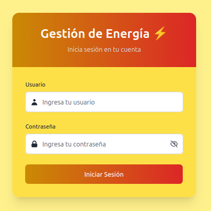

<br>

**Inicio**

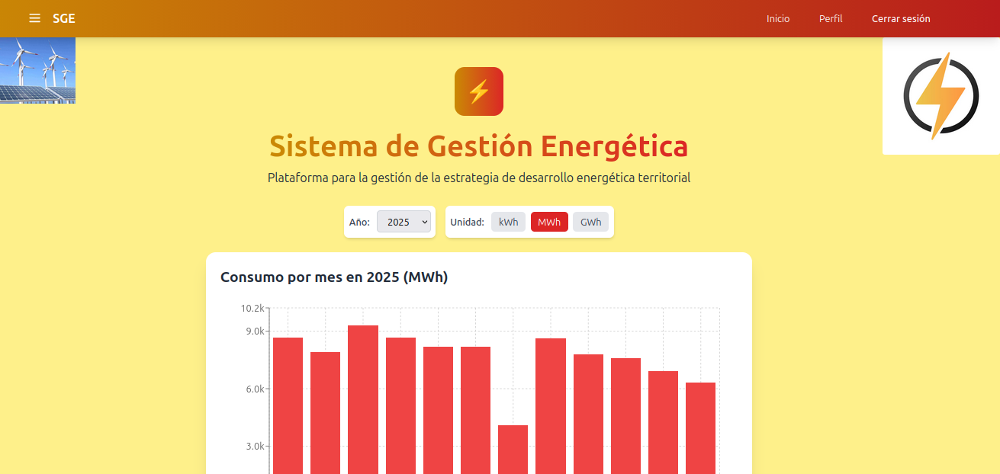

<br>

**Perfil de usuario**

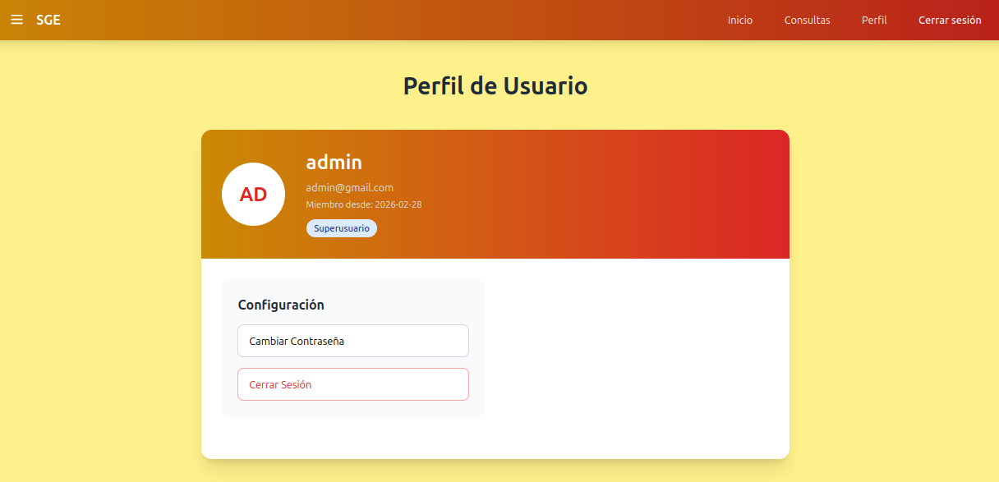

<br>

**Sidebar**

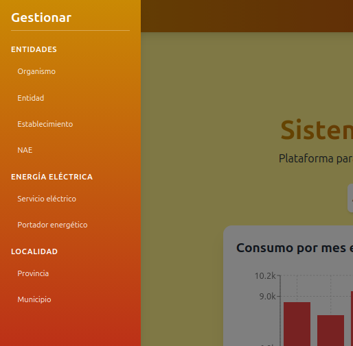

<br>

**Gestionar entidades**

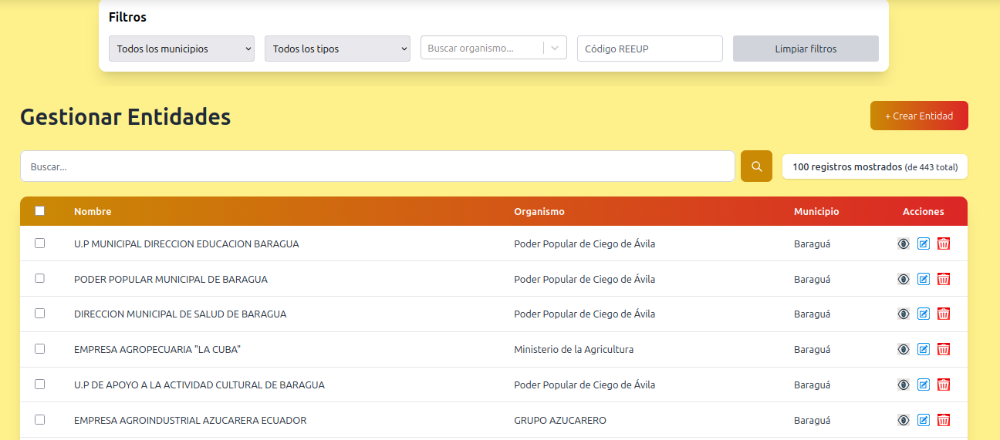

<br>

**Crear entidad**

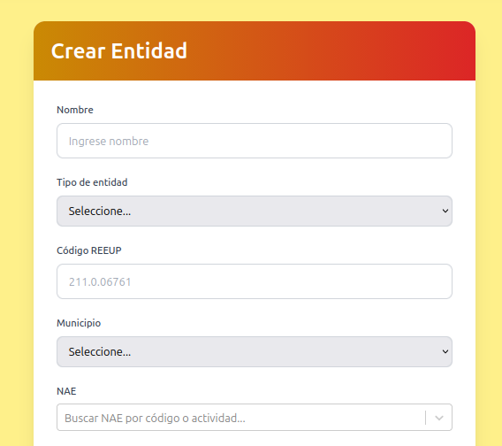

<br>

**Editar entidad**

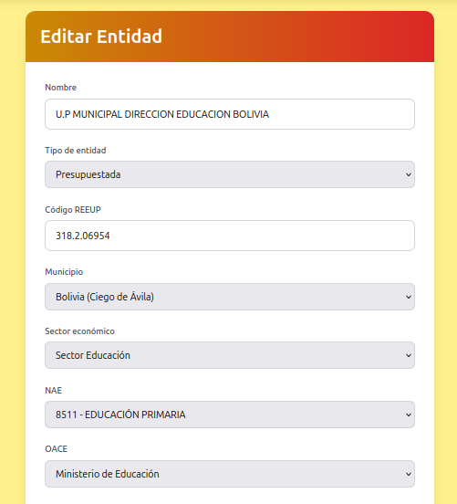

<br>

**Eliminar entidad**

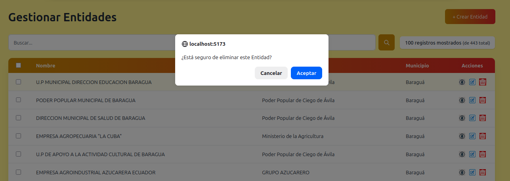

<br>

**Gestionar servicios eléctricos**

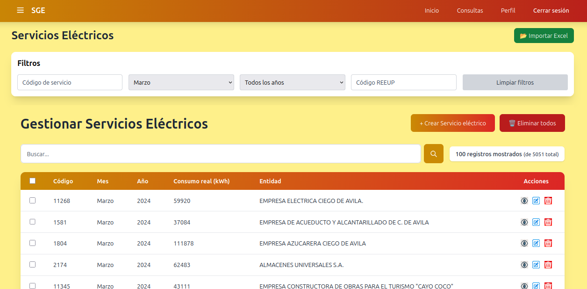

<br>

**Gestionar portadores energéticos**

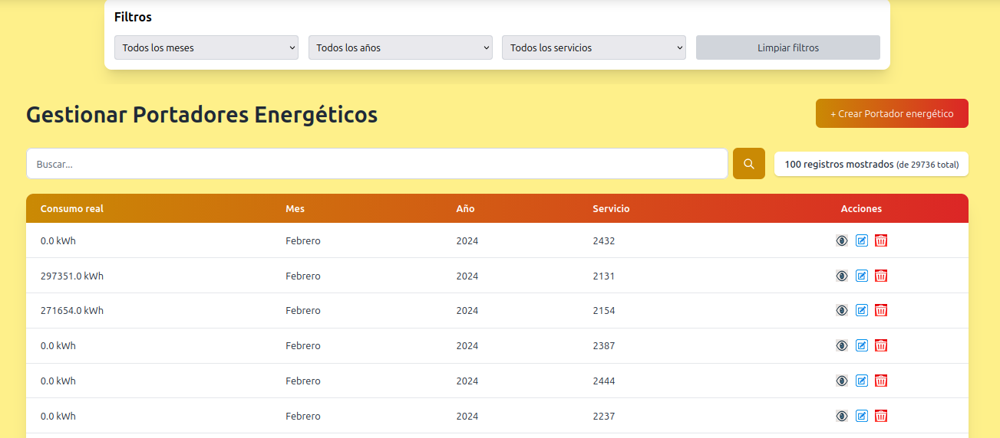

<br>

**Gráfico de consumo energético**

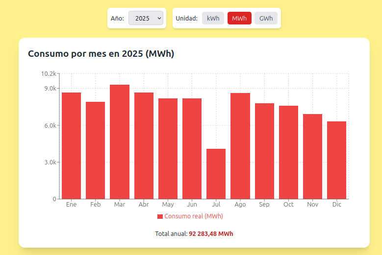

<br>


**Modelo lógico de la aplicación**

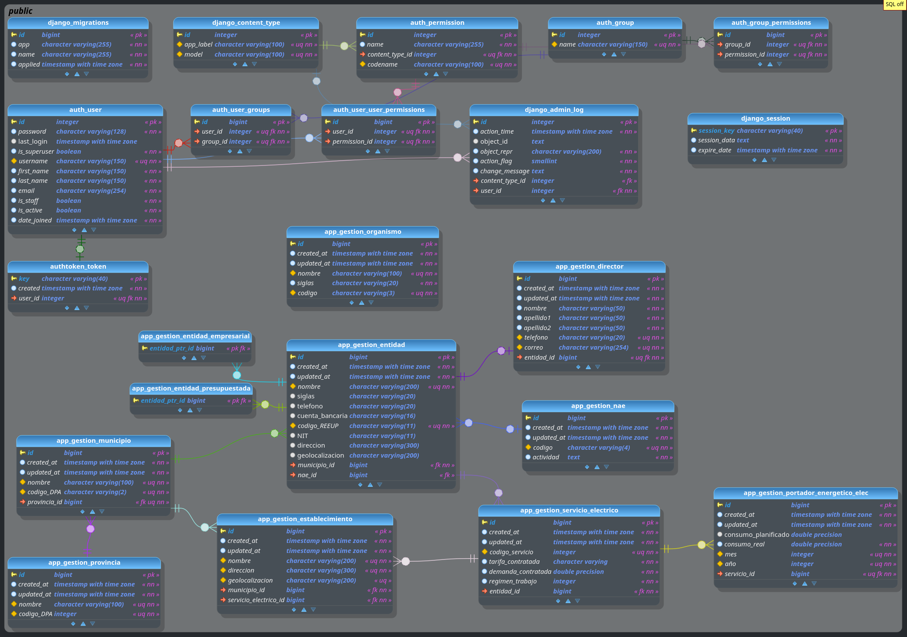